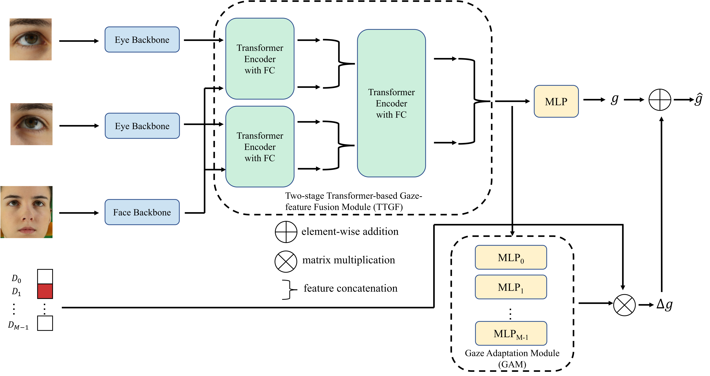

# GazeSetMerge
Merging Multiple Datasets for Improved Appearance-Based Gaze Estimation





### Train
```
python main.py --config ./configs/xxx.yaml
```

<!-- ### Cite
This repo's model is from the paper below:
```
``` -->